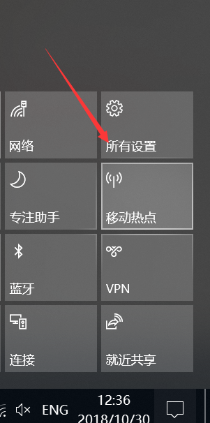
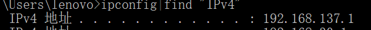
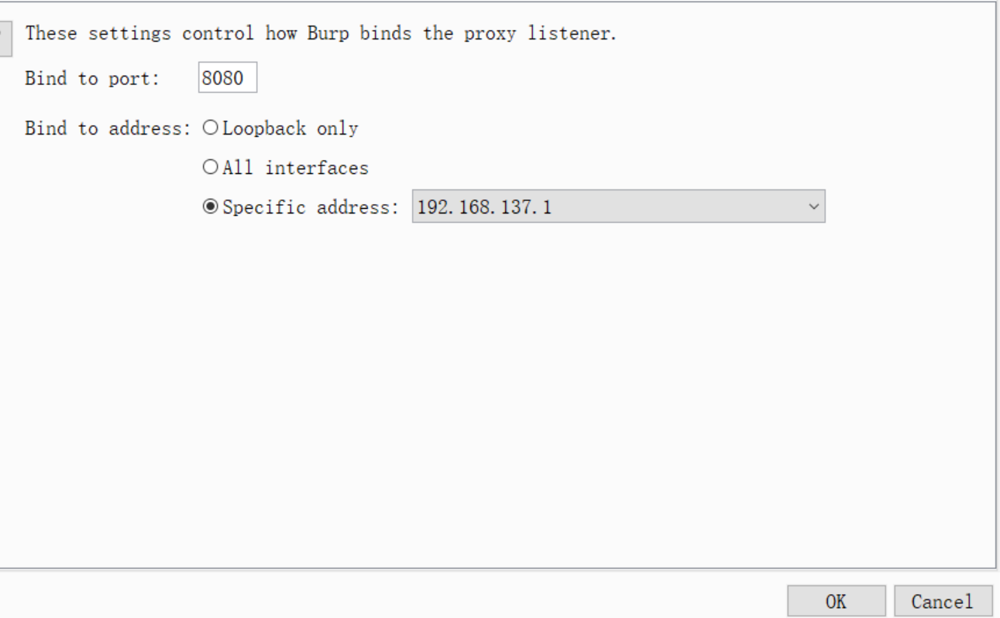
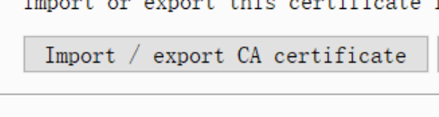
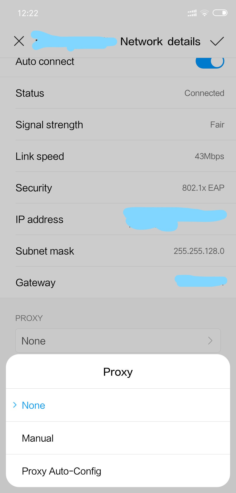
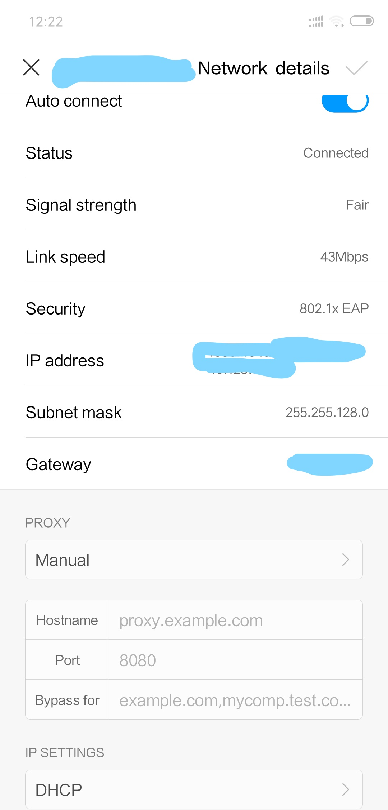

# 本文将介绍怎么在PC端使用Burpsuite进行安卓手机端的抓包  
---  
>`本文中使用的手机为本人的小米8,PC端的操作系统为win10`  

### 首先进行手机电脑的配置  
- PC端

  首先打开win10自带的移动热点功能  
  将手机连入PC打开的热点  

  

 然后查看打开热点的IP地址  

  

 再后对Burpsuite的代理进行如下配置  

  

 导出burpsuite的证书 **后缀名必须为.cer 否则手机端无法安装该证书，手机端安装的时候的使用方式设置为wlan**  

  

- 手机端  

  先安装从PC端Burpsuite中导入的后缀为.cer 的证书  

  再设置网络代理，代理IP为热点的IP，代理的端口为Burpsuite中设置的端口

---  
以上配置全部完成之后，可以使用手机浏览器访问网页，微信小程序等,burpsuite会拦截相关的数据包
